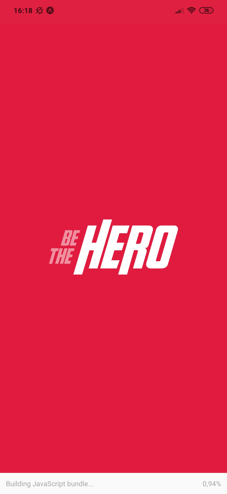
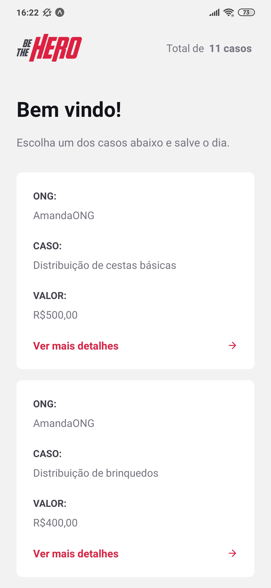
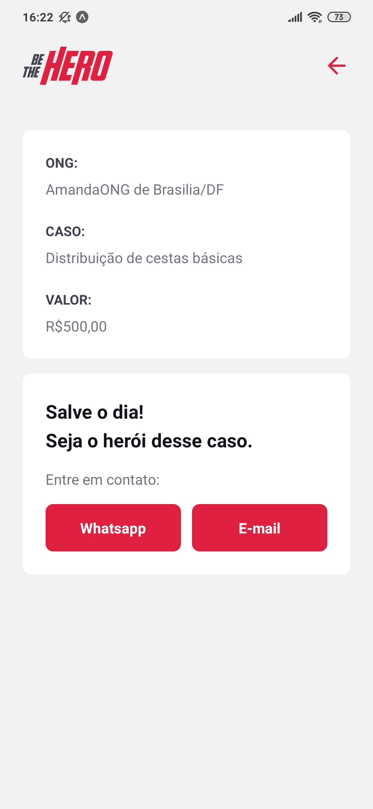

<h1>Be The Hero</h1>

<div align="center">
    
    <p>
        Aplicativo mobile que permite aos usuários contribuirem em causas de ONGs e se tornarem heróis do dia!
    </p>
    <div>
        <a href="#tecnologias">Tecnologias</a>
        &nbsp;&nbsp;&nbsp;|&nbsp;&nbsp;&nbsp;
        <a href="#desenvolvimento">Desenvolvimento</a>
        &nbsp;&nbsp;&nbsp;|&nbsp;&nbsp;&nbsp;
        <a href="#integracao">Integração</a>
        &nbsp;&nbsp;&nbsp;|&nbsp;&nbsp;&nbsp;
        <a href="#telas">Telas</a>
        &nbsp;&nbsp;&nbsp;|&nbsp;&nbsp;&nbsp;
        <a href="#creditos">Créditos</a>
    </div>
</div>


<h2 id="tecnologias">Tecnologias</h2>

+ [React Native](https://reactnative.dev/)
+ [Expo](https://expo.io/)


<h2 id="desenvolvimento">Desenvolvimento</h2>

Instale o Expo no computador:
```
$ npm install -g expo-cli
```

No arquivo [api.js](./src/services/api.js) preencha IP_ADDRESS com seu IP.


Inicie a aplicação:
```
$ npm start
```

Acesse http://localhost:19002/ para visualizar o QR code.

Abra o app [Expo](https://play.google.com/store/apps/details?id=host.exp.exponent) no seu Android ou o app Camera no iOS e scaneie o QR code.

Pronto!


<h2 id="integracao">Integração</h2>

API para utilização do aplicativo está disponível no repositório [Be The Hero - Backend](https://github.com/amandabezerra/be-the-hero-backend).


<h2 id="telas">Telas</h2>





<h2 id="creditos">Créditos</h2>

Este projeto foi produzido a partir de vídeos e materiais da Semana Omnistack 11 da [Rocketseat](https://rocketseat.com.br/).